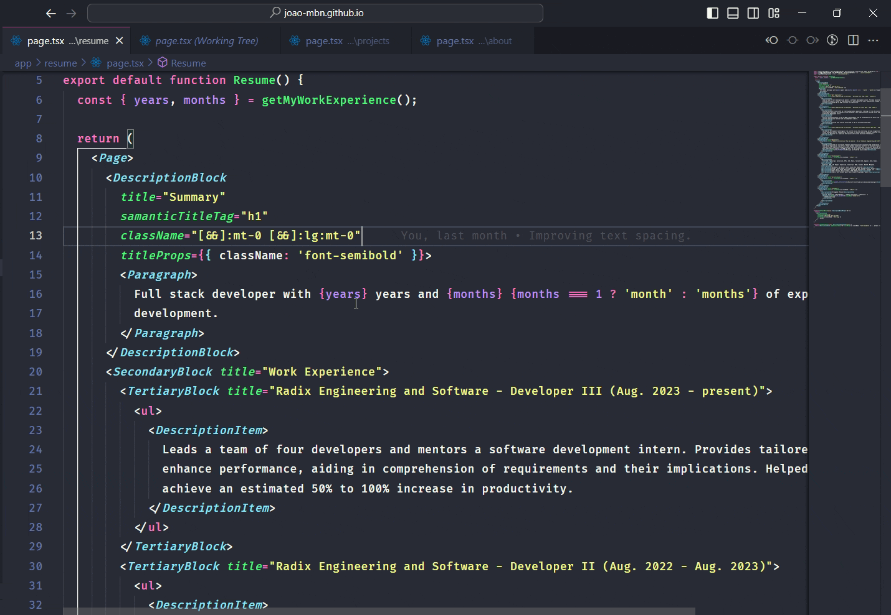

# VS Code React Extract

<p align="center">
  
</p>

This extension for Visual Studio Code provides a quick way to refactor your React code. It allows you to extract a valid piece of component code into a new function, automatically passing the props and building the extracted component interface, if using Typescript.

## Installation

[Get it at Visual Studio Code Marketplace: React Extract](https://marketplace.visualstudio.com/items?itemName=joao-mbn.react-extract)

## Features



- **Code Extraction**: Select a valid piece of React component code that you want to refactor.

- **Quick Refactor Action**: Use the Code Actions feature (`Ctrl + .` or `Cmd + .`, by default) to initiate the refactoring process.

- **Component Naming**: Pass the component name at the input prompt.

- **Automatic Prop Passing**: The extension will automatically identify and pass the necessary props to the new function.

- **TypeScript Support**: If you're using TypeScript, the extension will also build the interface for the new function.

- **Code Placement**: The new function will be placed at the bottom of the current file.

## Contributions

If you encounter any problems or have suggestions for improvements, please open an issue. Your feedback and contribution is appreciated. If you have the agreed solution as well, please open a pull request.

### Application Setup

Clone the repo, install dependencies and enter VS Code.

```sh
$ https://github.com/joao-mbn/react-extract.git
$ cd react-extract
$ npm i
$ code .
```

### Running and Debugging the Application

Go to **Run and Debug** and select **Run Extension** from the menu. Hit the play button or F5. For more information go to the [Official VS Code Extension Development Docs](https://code.visualstudio.com/api/get-started/your-first-extension).

### Running Tests

1. Install the [Extension Test Runner](https://marketplace.visualstudio.com/items?itemName=ms-vscode.extension-test-runner) and [TypeScript + Webpack Problem Matchers](https://marketplace.visualstudio.com/items?itemName=amodio.tsl-problem-matcher) extensions.
2. Open the Command Palette `Ctrl + Shift + P` or `Cmd + Shift + P`.
3. Select **Task: Run Task**.
4. Select **tasks: watch tests**.
5. Run the tests from the test explorer.

#### Creating a new Integration test for Extract Component

You can add a new folder under the `src/test/components` folder with the .jsx and .tsx files and their results using the project's naming convention via a script, as follows:

```sh
$ npm run create-test myNewTestCase
```

_Replace **myNewTestCase** with the appropriate test case name._

## Release Notes

[Checkout the Changelog](./CHANGELOG.md)

## Limitations

This extension is currently not fully supportive of Class Components. You can use it just fine on them, but the passed props may be wrongy extracted. Let it be known if you wish full support on them.

Even with this disclaimer, be welcome to open issues related to its use with Class Components, as to improve the implementation when support is given.

